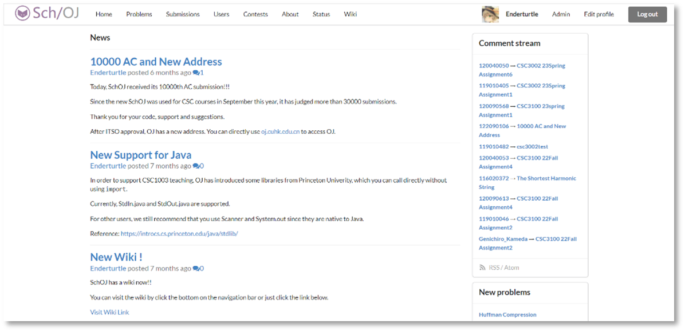
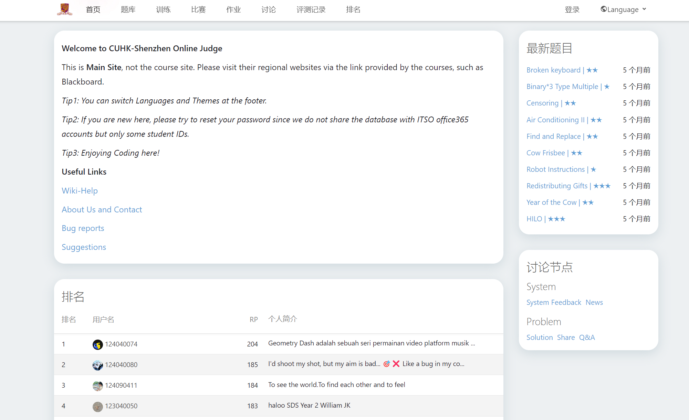
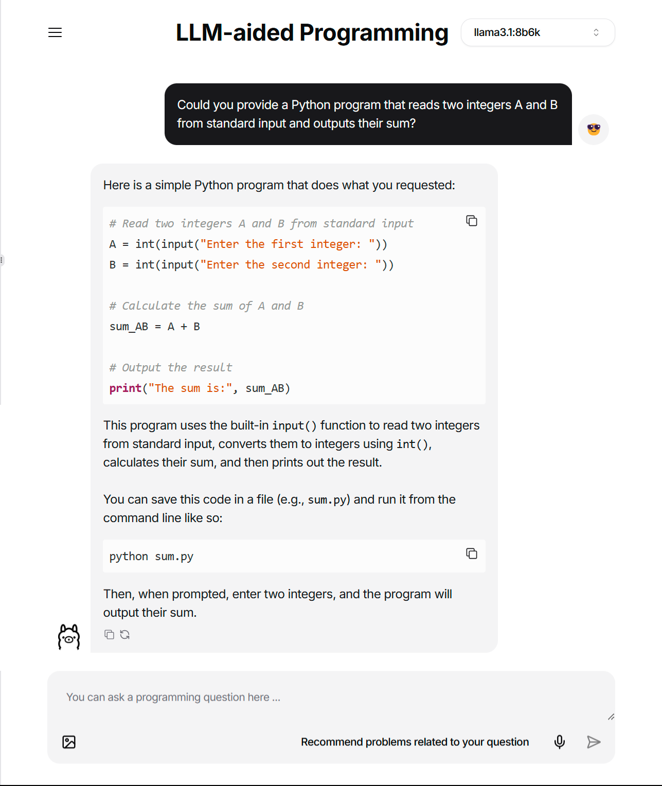
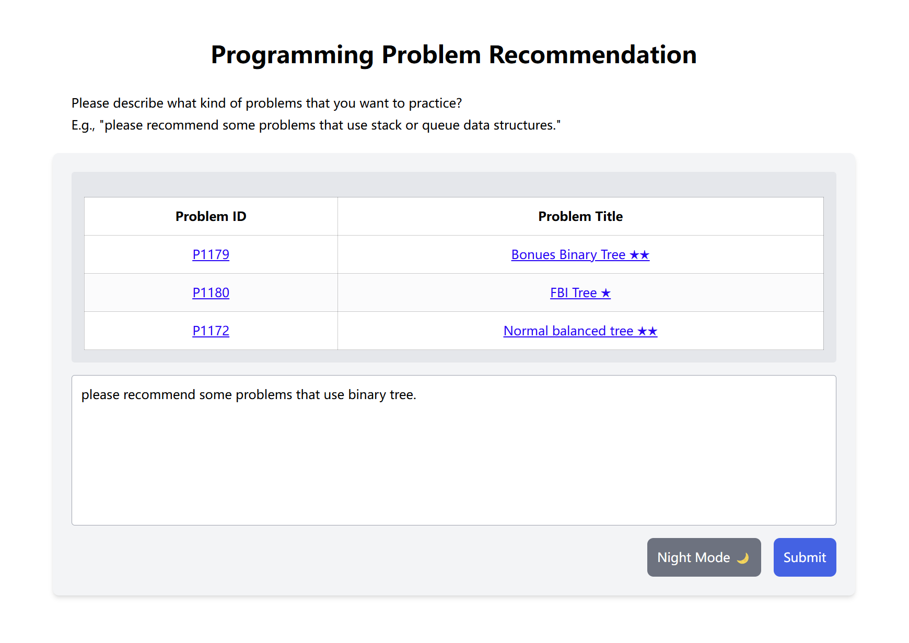

# CUHKSZOJ

> A campus-grown Online Judge for The Chinese University of Hong Kong, Shenzhen (CUHKSZ) that evolved from SchOJ → (re-engineering) → CUHKSZOJ, focusing on course-aligned evaluation, secure sandboxing, and intelligent assistance — **serving over 1,000 students across 10+ computer science courses every year**.

------

## Access & Availability

- **Campus-only access:** The OJ is reachable via the campus network/VPN only due to the policy by university. [https://oj.cuhk.edu.cn](https://oj.cuhk.edu.cn)
- **Open-source status:** Early stages (DMOJ/HydroOJ forks) referenced open projects; subsequent development is not directly open-sourced due to integrations with internal campus configurations (accounts, course pipelines, infra policies). 

------

## History

### Origin — SchOJ (DMOJ-based fork)

- Started by CUHKSZ Computer Association **C@C**, forked from **[DMOJ](https://github.com/DMOJ)**, named **[SchOJ](https://github.com/SchOJ)** for on-campus practice & contest training.

### 2021 — Ownership & Judge Backend Upgrade

- Project handed over to the author after 2021 enrollment; led backend revamp for stability/observability.

- **Added SQL, and special libraries support for Java** to extend beyond classic OJ problem types.

- Added a new wiki page for answering students' questions.

  
  
  

### 2023 — Extend HydroOJ

- Migrated to **[HydroOJ](https://github.com/HydroOJ)** and conducted deep customization:

  - **Custom libraries** (bundle libs/data/tools per assignment).

  - **Isolated/containerized judging** with resource quotas & network policies.

  - **Course-specific evaluation** (multi-stage scripts, special libraries).

  Temporarily used [PhxOJ](https://github.com/phxoj) as name for early stage developments.
  
  

### 2024 — AI Agent & Retrieval-Augmented Generation (RAG)

- Introduced **AI Agent** for guided problem-solving, error localization, and related-problem suggestions.

- Built a **RAG pipeline** for **personalized problem sets** based on questions.

  
  
  

## Acknowledgements

- Foundations: [DMOJ](https://github.com/DMOJ) · [SchOJ](https://github.com/SchOJ) · [HydroOJ](https://github.com/HydroOJ)

